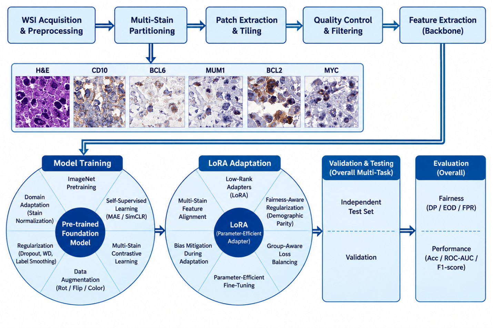
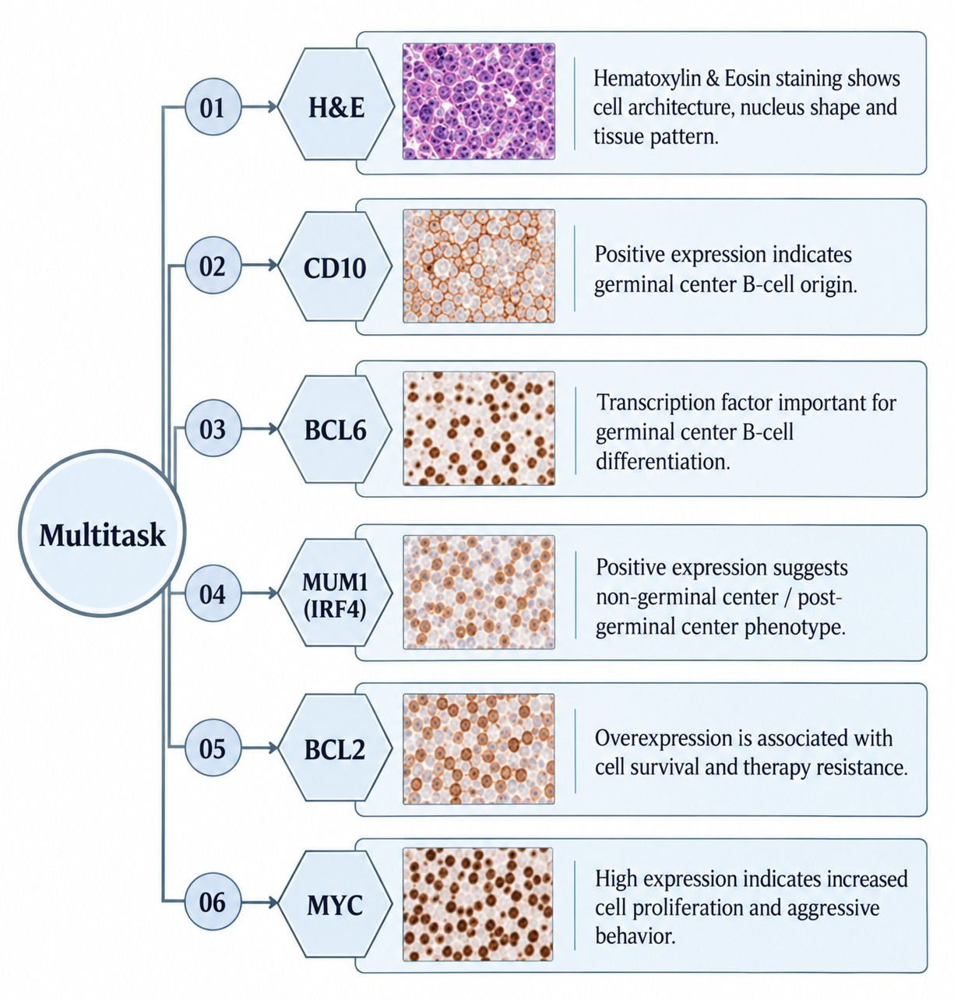
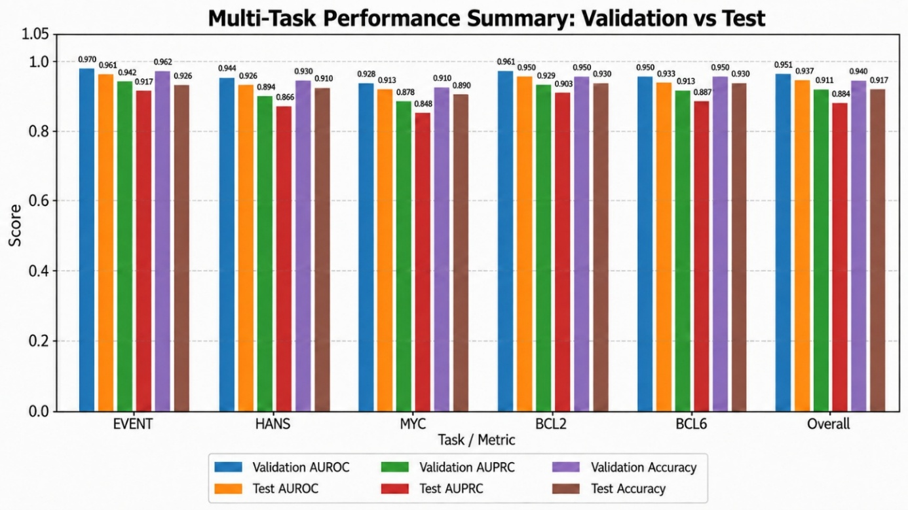
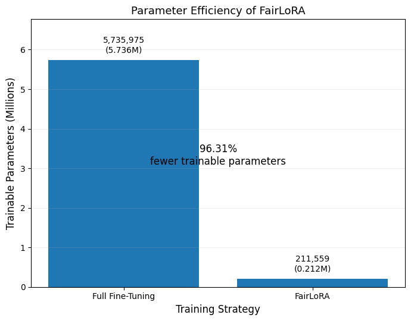
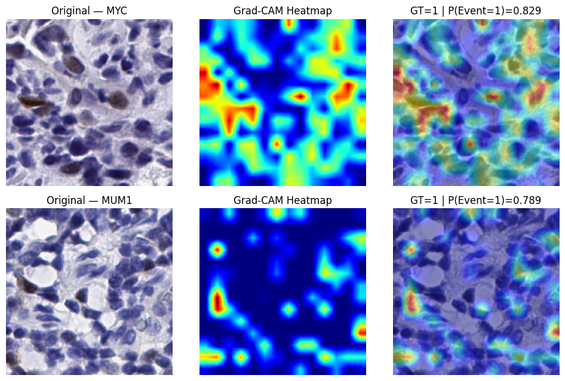

# FairLoRA-Enabled Multimodal Multi-Task Learning for Patient-Level DLBCL Characterization

This repository contains the implementation associated with the paper:

**FairLoRA-Enabled Multimodal Multi-Task Learning for Patient-Level DLBCL Characterization**

The proposed framework combines **multi-stain histopathology**, **quantitative cellular morphology**, **structured clinical information**, **FairLoRA-based parameter-efficient adaptation**, **hierarchical attention**, **multi-task learning**, **survival-risk estimation**, and **fairness-aware optimization** for patient-level characterization of diffuse large B-cell lymphoma (DLBCL).

---

## Overview

Diffuse large B-cell lymphoma (DLBCL) is highly heterogeneous across morphology, immunophenotype, and clinical presentation. The proposed framework is designed to integrate complementary patient-level information while preserving the biological relationships among multiple pathology stains and related clinical endpoints.

The framework uses:

- H&E, CD10, BCL6, MUM1/IRF4, BCL2, and MYC pathology
- a pretrained ViT-Tiny/16 backbone
- FairLoRA-based low-rank adaptation
- patch-level and stain-level hierarchical attention
- quantitative cellular morphology
- structured clinical information
- shared multi-task prediction
- survival-risk estimation
- age-aware fairness evaluation

<p align="center">
  
</p>

<p align="center">
  <b>Overall workflow of the proposed FairLoRA-enabled multimodal and multi-task DLBCL framework.</b>
</p>

---

## Methodology

### 1. Patient-Level Data Preparation

All pathology patches, morphology measurements, clinical attributes, and prediction targets are aligned using the patient identifier. Patient-level splitting is performed before model optimization to prevent correlated patches from the same patient from appearing across different experimental partitions.

### 2. Multi-Stain Histopathology

The pathology branch integrates six complementary staining modalities:

- H&E
- CD10
- BCL6
- MUM1/IRF4
- BCL2
- MYC

Each stain provides complementary morphological or immunophenotypic information relevant to DLBCL characterization.

<p align="center">
  
</p>

<p align="center">
  <b>Hierarchical multi-stain representation showing the contribution of the six pathology modalities.</b>
</p>

### 3. FairLoRA-Based Visual Adaptation

A pretrained ViT-Tiny/16 backbone is adapted using FairLoRA. The low-rank adaptation strategy keeps the majority of pretrained backbone parameters fixed while optimizing a substantially smaller set of task-adaptive parameters.

### 4. Hierarchical Attention

The framework applies two levels of attention:

- **Patch-level attention** to identify informative tissue regions within each stain.
- **Stain-level attention** to learn the relative contribution of each available staining modality at the patient level.

### 5. Multimodal Fusion

The learned pathology representation is combined with quantitative cellular morphology and structured clinical information to obtain a unified patient-level multimodal representation.

### 6. Multi-Task Prediction

The shared multimodal representation supports five classification endpoints:

- EVENT
- HANS
- MYC
- BCL2
- BCL6

Separate task-specific prediction heads are used while preserving a common patient-level representation.

### 7. Survival-Risk Estimation

A dedicated survival branch produces a continuous patient-level risk score and is optimized using a pairwise ranking-based survival objective.

### 8. Fairness-Aware Learning

Age is retained as a protected attribute for fairness analysis rather than being directly included as a predictive feature. Fairness assessment includes subgroup disparity analysis using metrics such as demographic parity, equal opportunity, false-positive-rate differences, subgroup AUROC, and survival concordance gaps.

---

## Dataset

The experiments were conducted using the **DLBCL-Morph cohort**.

The final experimental cohort contains:

| Partition | Patients |
|---|---:|
| Training | 117 |
| Validation | 26 |
| Test | 27 |
| **Total** | **170** |

The framework integrates multi-stain pathology, cellular morphology, immunohistochemistry information, and structured patient-level clinical variables.

---

## Experimental Setup

| Component | Experimental Setting |
|---|---|
| Computing platform | Google Colab |
| GPU | NVIDIA L4 |
| GPU memory | approximately 23.7 GB |
| Framework | PyTorch 2.11.0 |
| CUDA | CUDA 12.8 |
| Input image size | 224 × 224 RGB |
| Visual backbone | Pretrained ViT-Tiny/16 |
| Adaptation strategy | FairLoRA / low-rank attention adaptation |
| LoRA rank | 8 |
| Optimizer | AdamW |
| Main image modalities | H&E, CD10, BCL6, MUM1, BCL2, MYC |
| Prediction formulation | Shared multi-task learning |
| Main outputs | EVENT, HANS, MYC, BCL2, BCL6 |
| Survival analysis | Overall-survival risk and concordance analysis |

---

## Results

The proposed framework achieved the following overall performance on the held-out test cohort:

| Metric | Performance |
|---|---:|
| AUROC | **0.937** |
| AUPRC | **0.884** |
| Accuracy | **0.917** |

Task-specific test AUROCs were:

| Task | AUROC |
|---|---:|
| EVENT | **0.961** |
| HANS | **0.926** |
| MYC | **0.913** |
| BCL2 | **0.950** |
| BCL6 | **0.933** |

<p align="center">
  
</p>

<p align="center">
  <b>Multi-task performance comparison across validation and independent test results.</b>
</p>

---

## Parameter Efficiency

FairLoRA reduced the number of trainable parameters from **5,735,975** to **211,559**, corresponding to a **96.31% reduction** compared with full fine-tuning.

<p align="center">
  
</p>

<p align="center">
  <b>Comparison of trainable parameters for full fine-tuning and FairLoRA adaptation.</b>
</p>

---

## Fairness Analysis

All reported validation fairness gaps remained below **0.10**. The framework evaluates age-based subgroup disparities while keeping age separate from the direct predictive representation.

Detailed fairness analyses are reported in the paper using demographic parity, equal opportunity, false-positive-rate differences, AUROC disparity, and survival-concordance gaps.

---

## Interpretability

Gradient-based interpretability is used to visualize regions contributing to model decisions for representative pathology cases.

<p align="center">
  
</p>

<p align="center">
  <b>Gradient-based interpretability examples showing original pathology patches, Grad-CAM heatmaps, and overlay visualizations.</b>
</p>

---

## Suggested Repository Structure

```text
YOUR_REPOSITORY_NAME/
│
├── README.md
├── requirements.txt
├── main.py
│
├── figures/
│   ├── overall_workflow.png
│   ├── hierarchical_multistain.png
│   ├── multitask_performance.png
│   ├── parameter_efficiency.png
│   └── gradcam_interpretability.png
│
└── src/
    └── ...
```

---

## Installation

Clone the repository:

```bash
git clone https://github.com/YOUR_USERNAME/YOUR_REPOSITORY_NAME.git
cd YOUR_REPOSITORY_NAME
```

Install the required dependencies:

```bash
pip install -r requirements.txt
```

---

## Usage

Update the dataset paths and configuration according to your local environment, then run the main training script.

Example:

```bash
python main.py
```

---

## Citation

If you use this work, please cite the associated paper. Replace the placeholder author and publication information with the final bibliographic details after publication.

```bibtex
@article{fairlora_dlbcl_2026,
  title   = {FairLoRA-Enabled Multimodal Multi-Task Learning for Patient-Level DLBCL Characterization},
  author  = {Authors},
  year    = {2026}
}
```

---

## Notes

The repository README presents only the most important visual results. The complete paper contains additional training curves, survival analysis, fairness-generalization results, and pathology examples that can be consulted for the full experimental evaluation.
